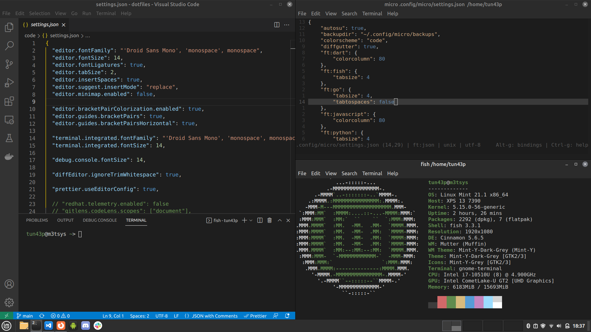

# Dotfiles

## Table of contents

- [Dotfiles](#dotfiles)
  - [Table of contents](#table-of-contents)
  - [Informations](#informations)
  - [Colorscheme](#colorscheme)
    - [VSCode Dark+](#vscode-dark)
    - [Defaults](#defaults)
    - [Base 16](#base-16)
    - [Base 256](#base-256)
  - [Authors](#authors)
  - [License](#license)

## Informations

- **Device**: Dell XPS
- **Distribution**: Linux Mint
- **Window Manager**: Cinnamon

## Colorscheme

### VSCode Dark+

### Defaults

- `#D4D4D4`: `foreground` - `Base 05`
- `#1E1E1E"`: `background` - `Base 00`
- `#D4D4D4`: `cursor` - `Base 05`

### Base 16

- `#1E1E1E`: `color00` - `Base 00` - **Black**
- `#D16969`: `color01` - `Base 08` - **Red**
- `#608B4E`: `color02` - `Base 0B` - **Green**
- `#D7BA7D`: `color03` - `Base 0A` - **Yellow**
- `#569CD6`: `color04` - `Base 0D` - **Blue**
- `#C586C0`: `color05` - `Base 0E` - **Magenta**
- `#9CDCFE`: `color06` - `Base 0C` - **Cyan**
- `#D4D4D4`: `color07` - `Base 05` - **White**
- `#3C3C3C`: `color08` - `Base 03` - **Bright Black**
- `#D16969`: `color09` - `Base 08` - **Bright Red**
- `#608B4E`: `color10` - `Base 0B` - **Bright Green**
- `#D7BA7D`: `color11` - `Base 0A` - **Bright Yellow**
- `#569CD6`: `color12` - `Base 0D` - **Bright Blue**
- `#C586C0`: `color13` - `Base 0E` - **Bright Magenta**
- `#9CDCFE`: `color14` - `Base 0C` - **Bright Cyan**
- `#FFFFFF`: `color15` - `Base 07` - **Bright White**

### Base 256

- `#B5CEA8`: `color16` - `Base 09`
- `#CE9178`: `color17` - `Base 0F`
- `#262626`: `color18` - `Base 01`
- `#303030`: `color19` - `Base 02`
- `#808080`: `color20` - `Base 04`
- `#E9E9E9`: `color21` - `Base 06`

## Authors

- **tun43p** - _Initial work_ - [tun43p](https://github.com/tun43p).

## License

This project is licensed under the MIT License - see the [LICENSE](LICENSE) file for details.
